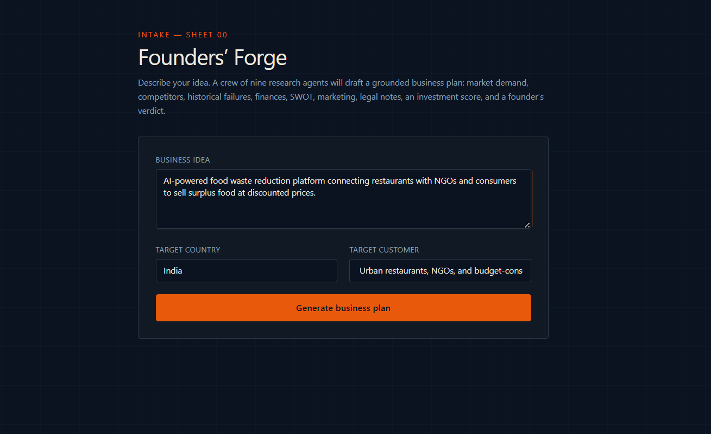
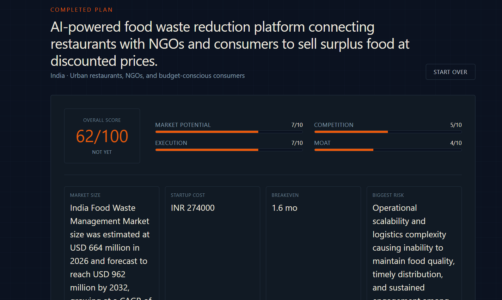
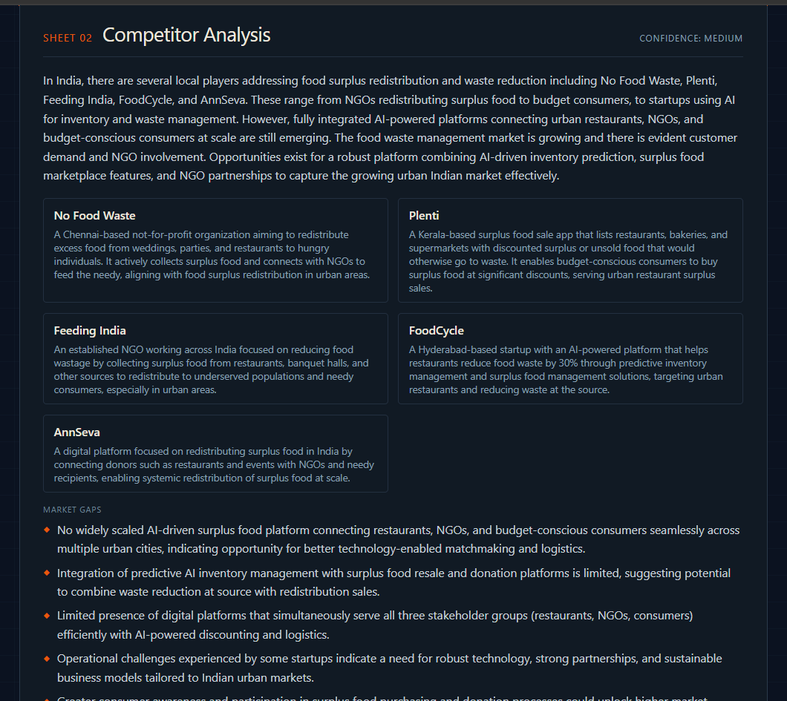
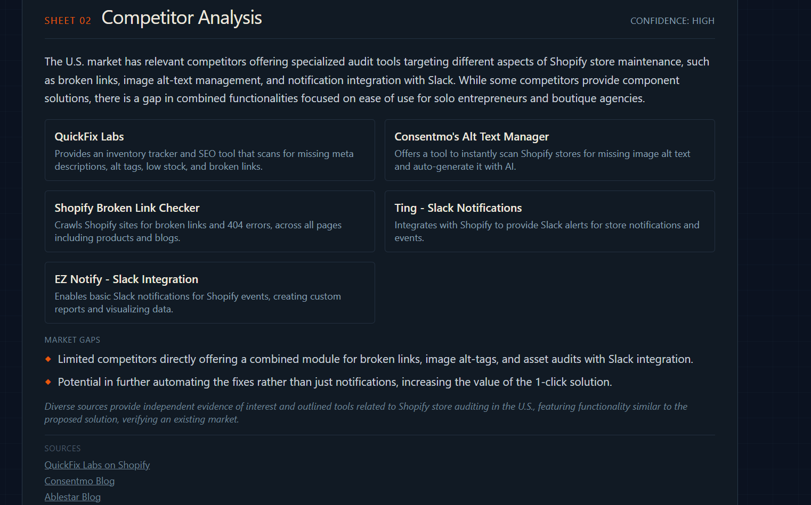
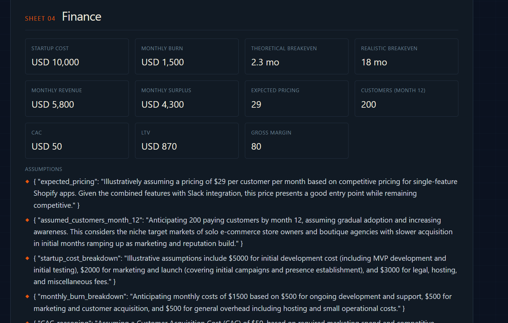
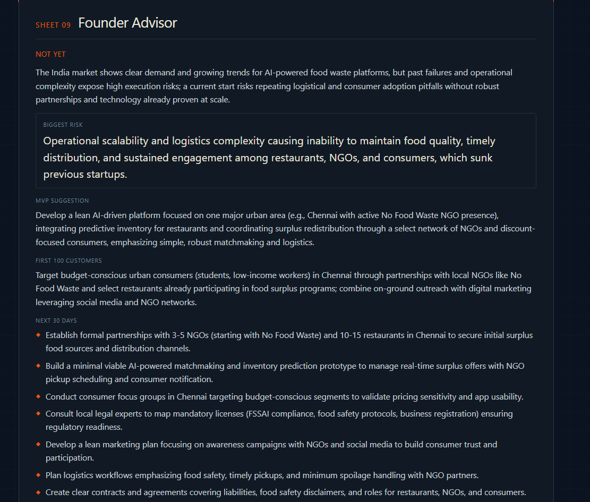
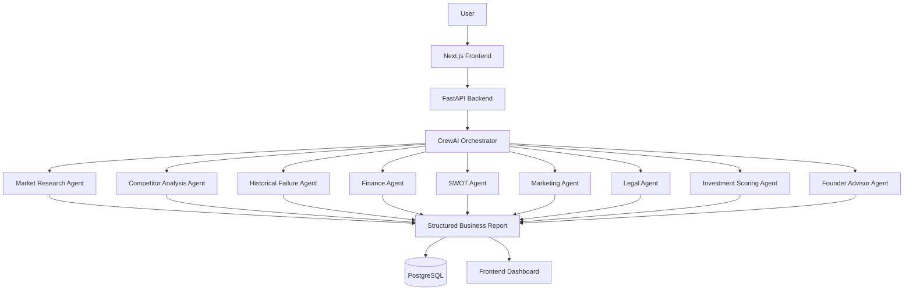

# Founders' Forge — Multi-Agent Startup Consultant

> Validate startup ideas using an AI consulting team powered by multiple specialized AI agents.

## Live Demo

🔗 https://founders-forge-frontend-nine.vercel.app/

## Screenshots

### Home

### Executive Summary

### Market Research

### Competitor Analysis

### Financial Analysis

### Founder Recommendation

Founders' Forge is an AI-powered startup consulting platform that helps aspiring founders validate business ideas before investing time and money.

Instead of relying on a single LLM response, Founders' Forge orchestrates a team of specialized AI agents that perform market research, competitor analysis, financial planning, legal research, SWOT analysis, marketing strategy, investment evaluation, and founder recommendations.

The platform combines live web research, structured reasoning, and multi-agent collaboration to generate a structured startup analysis report grounded in real-world information.

---

## Why Founders' Forge?

Early-stage founders often struggle to answer questions like:

- Is there real demand for my idea?
- Who are my competitors?
- Has a similar startup failed before?
- What legal requirements should I know?
- How much capital might I need?
- Is this business actually worth building?

Founders' Forge acts like an AI consulting firm by answering these questions through specialized AI agents instead of producing a generic business plan.

---

## Features

### AI Consulting Team
- 9 specialized AI agents
- Multi-agent orchestration with CrewAI
- Live web-grounded research
- Structured startup analysis report

### Business Analysis
- Market research
- Competitor analysis
- Historical startup failure analysis
- SWOT analysis
- AI-generated financial estimates
- Investment scoring
- Founder recommendations

### Engineering
- FastAPI REST API
- PostgreSQL persistence
- Next.js frontend
- Structured JSON outputs

---

## Architecture

## Tech Stack

### Backend

- Python
- FastAPI
- CrewAI
- OpenAI GPT-4o
- Serper API
- PostgreSQL
- SQLAlchemy

### Frontend

- Next.js
- React
- TypeScript
- Tailwind CSS

---

## Example Output

For every startup idea, Founders' Forge generates:

- Executive Summary
- Market Research
- Competitor Analysis
- Historical Failures
- Financial Analysis
- SWOT Analysis
- Marketing Strategy
- Legal Requirements
- Investment Score
- Founder Recommendation

---

## API Endpoints

| Method | Endpoint | Description |
|---------|----------|-------------|
| GET | / | Health Check |
| POST | /generate-plan | Generate startup report |
| GET | /plans | View saved reports |
| GET | /plans/{id} | Retrieve a report |

---

## Future Improvements

- Memory across startup iterations
- Investor-ready pitch deck generation
- PDF export
- Interactive financial modeling
- Follow-up consulting chat
- Additional integrations

---

> **Note:** Founders' Forge is intended as a decision-support tool for early-stage idea validation. The generated analyses should be treated as starting points for further research rather than professional financial or legal advice.

## License

MIT
